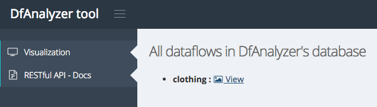
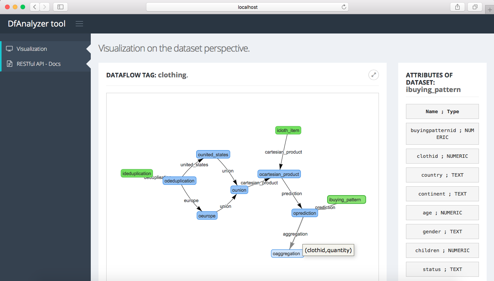

# Dataflow Viewer (DfViewer)

## Dataflow viewer

After the initialization of Provenance Data Extractor, users can also analyze dataflow specifications stored in our provenance database using DfViewer. DfViewer is a feature provided by our Web application.

As a first step, users have to use a Web browser (*e.g.*, Google Chrome) with the following URL for accessing DfViewer features:

```
http://localhost:22000 # users can also use the hostname for external connections
```
Then, they have access to a list of dataflow specifications stored in DfAnalyzer's database.



Since users have decided to view a specific dataflow by clicking on the button with the name *View* (*e.g.*, to analyze dataflow specification with tag *clothing*), then the following web page will be provided to them. This visualization consists of a dataset perspective view of the dataflow specification, where users can investigate the schema (*i.e.*, attributes of each dataset).



