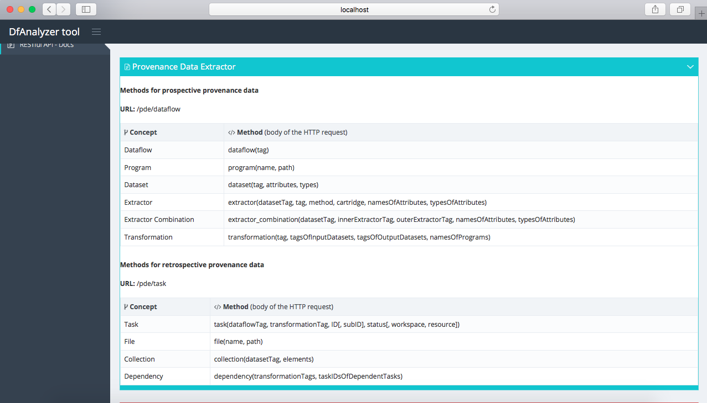

# Provenance Data Extractor

## Overview

Provenance Data Extractor (PDE) is a DfAnalyzer component responsible for extracting provenance and scientific data from scientific applications. With this purpose, PDE delivers a RESTful API that users can send HTTP request with POST method in order to register data extracted from their applications. These extracted data follows a dataflow abstraction, considering file and data element flow monitoring. Then, PDE stores these extracted data into a provenance database to enable online query processing.

## Software requirements

PDE requires the installation of two softwares. 

1. [Java SE Development Kit (JDK)](http://www.oracle.com/technetwork/java/javase/downloads/index.html), which can be installed following the steps provided by Oracle Corporation;
2. [MonetDB](https://www.monetdb.org/Home), column-oriented database management system (DBMS). It can be installed and configured following the [user guide](https://www.monetdb.org/Documentation/UserGuide) provided on MonetDB's website.

## About this directory

We provide a compressed file of our MonetDB database (to DfAnalyzer) for a local execution of PDE. Therefore, users only need to configure some environment variables (as discussed in the next section) and run the script `start-dfa.sh`. We assume the execution of these steps in an Unix-based operating system.

## Environment configuration

After the software installation step, users have to define some environment variables and others in the `PATH` variable of the operating system.

To configure MonetDB in the operating system, users have to add the binary directory of this DBMS to the environment variable `PATH`, as follows:

```
export MONETDB=/program/monetdb
export PATH=$PATH:$MONETDB/bin
```

## Starting DfAnalyzer tool

After environment configuration, PDE can be initialized by invoking the script `start-dfa.sh` in a terminal tab, as follows:

```
./start-dfa.sh
```

Then, a similar output message should be displayed in the terminal tab:

```
Setting up environment variables...
--------------------------------------------
Cleaning up...
--------------------------------------------
Restoring MonetDB database...
--------------------------------------------
Starting database system...
property            value
hostname         localhost
dbfarm           /app/dfanalyzer-spark/data
status           monetdbd[3068] 1.7 (Jul2017-SP1) is serving this dbfarm
mserver          /program/monetdb/bin/mserver5
logfile          /app/dfanalyzer-spark/data/merovingian.log
pidfile          /app/dfanalyzer-spark/data/merovingian.pid
sockdir          /tmp
listenaddr       localhost
port             50000
exittimeout      60
forward          proxy
discovery        true
discoveryttl     600
control          no
passphrase       <unknown>
mapisock         /tmp/.s.monetdb.50000
controlsock      /tmp/.s.merovingian.50000
starting database 'dataflow_analyzer'... done
      name         state   health                       remarks
dataflow_analyzer  R  0s  100% 11s  mapi:monetdb://localhost:50000/dataflow_analyzer
--------------------------------------------
Starting DfA RESTful API

  .   ____          _            __ _ _
 /\\ / ___'_ __ _ _(_)_ __  __ _ \ \ \ \
( ( )\___ | '_ | '_| | '_ \/ _` | \ \ \ \
 \\/  ___)| |_)| | | | | || (_| |  ) ) ) )
  '  |____| .__|_| |_|_| |_\__, | / / / /
 =========|_|==============|___/=/_/_/_/
 :: Spring Boot ::        (v1.5.8.RELEASE)

2017-11-09 09:12:44.451  INFO 3073 --- [           main] rest.server.WebApplication               : Starting WebApplication v1.0 on mercedes with PID 3073 (/app/dfanalyzer-spark/dfa/REST-DfA-1.0 started by vitor in /app/dfanalyzer-spark)
...
2017-11-09 09:12:55.397  INFO 3073 --- [           main] o.s.j.e.a.AnnotationMBeanExporter        : Registering beans for JMX exposure on startup
2017-11-09 09:12:55.419  INFO 3073 --- [           main] o.s.c.support.DefaultLifecycleProcessor  : Starting beans in phase 0
2017-11-09 09:12:55.815  INFO 3073 --- [           main] s.b.c.e.t.TomcatEmbeddedServletContainer : Tomcat started on port(s): 22000 (http)
2017-11-09 09:12:55.833  INFO 3073 --- [           main] rest.server.WebApplication               : Started WebApplication in 12.433 seconds (JVM running for 13.257)
```

## RESTful API documentation

Since our RESTful application have been initialized, users can submit HTTP requests with POST method to PDE for extracting provenance and scientific data. Then, considering the dataflow abstraction followed by DfAnalyzer, users have to introduce a message according to this abstraction. Therefore, PDE provides a set of methods to be present in the HTTP messsage, as follows:


This web page (http://localhost:22000/dfview/help) can be accessed using a browser after the initialization of PDE.

### **Example**

**Dataflow Specification**

As an example of dataflow specification to be included in our provenance database, users submit the following HTTP request to PDE, considering a dataflow with two data transformations:

HTTP message send to the URL `http://localhost:22000/pde/dataflow`

```
dataflow(clothing)

program(ClothingApp::deduplication(),"/root/app");

dataset(ideduplication, , )
extractor(ideduplication,ideduplication,EXTRACTION,PROGRAM,
	{customerid;country;continent;age;gender;children;status},
	{numeric;text;text;numeric;text;numeric;text})

dataset(odeduplication, , )
extractor(odeduplication,odeduplication,EXTRACTION,PROGRAM,
	{customerid;country;continent;age;gender;children;status}
	{numeric;text;text;numeric;text;numeric;text})

transformation(deduplication,{ideduplication},{odeduplication},
	{ClothingApp::deduplication()})

program(ClothingApp::europe(),"/root/app");

dataset(oeurope, , )
extractor(oeurope,oeurope,EXTRACTION,PROGRAM,
	{customerid;country;continent;age;gender;children;status},
	{numeric;text;text;numeric;text;numeric;text})

transformation(europe,{odeduplication},{oeurope},
	{ClothingApp::europe()})
```

**Task record**

After the dataflow specification, provenance and scientific data generated during the execution of scientific applications can be registered in our provenance database. In this case, PDE has to capture HTTP request in the task level (*i.e.*, execution of a data transformation).

For example, the following message should be sent in a HTTP request to the URL

`http://localhost:22000/pde/task`

```
task(clothing,deduplication,1,1,FINISHED,
	/root/app/deduplication,spark://localhost:22000)

collection(ideduplication,{
	{/root/app/input/customer_list1/customer_list1.data};
	{/root/app/input/customer_list2/customer_list2.data};
	{/root/app/input/customer_list3/customer_list3.data};
	{/root/app/input/customer_list4/customer_list4.data}})

collection(odeduplication,{
	{/root/app/input/deduplication/odeduplication.index}})
```

