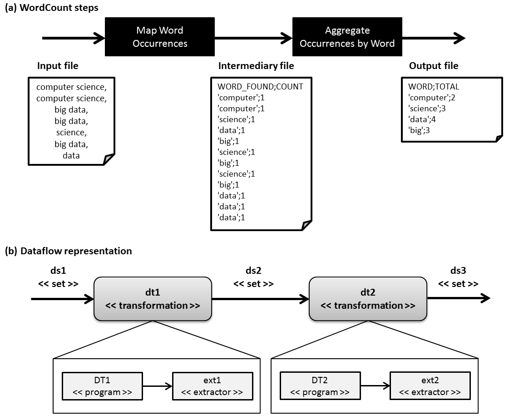

# Provenance Data Gatherer (PG)

## Software requirements
1. [Java SE Development Kit (JDK)](http://www.oracle.com/technetwork/pt/java/index.html)

## Example of WordCount Application

To present PG, we consider a classic MapReduce application: WordCount. This application is divided in two steps:

1. Detection of word occurrences in each input file; and
2. Aggregation of occurrences by word to compute the amount of occurrences of each word.

The figure below presents WordCount steps and its associated dataflow.

The manipulated files by this example can be found in [this Git directory](https://github.com/hpcdb/armful/tree/gh-pages/src/dfanalyzer/pg)

## JAR program
Before to start the generation of provenance files in JSON format, a configuration file, named as *DfA.properties*, need to be created with the PG and DI directories (attributes *pg_dir* and *di_dir*, respectively) in the same directory that user invokes PG JAR program. PG directory contains the file path that PG will generate JSON files. Once a JSON file was completely edited by PG program, it is moved to the Data Ingestor (DI) directory with the purpose of being consumed by DI program. 

An example of this *DfA.properties* is presented below:

    pg_dir=/root/dfa/pg_dir
    di_dir=/root/dfa/di_dir

Considering WordCount example, the following command lines can be invoked, using PG JAR program, for generating a JSON file with prospective provenance data. 

Command lines for prospective provenance data:

	# Dataflow dfexample
    java -jar PG.jar -dataflow -tag dfexample

    # Transformation dt1
	java -jar PG.jar -transformation -dataflow dfexample -tag dt1
	java -jar PG.jar -program -dataflow dfexample -transformation dt1 -name DT1 -filepath /root/bin/DT1.bin

	# Data set ds1
	java -jar PG.jar -set -dataflow dfexample -transformation dt1 -tag ds1 -type input
	java -jar PG.jar -attribute -dataflow dfexample -transformation dt1 -set ds1 -name FILE_ID -type numeric
	java -jar PG.jar -attribute -dataflow dfexample -transformation dt1 -set ds1 -name FILE -type file

	# Data set ds2
	java -jar PG.jar -set -dataflow dfexample -transformation dt1 -tag ds2 -type output
	java -jar PG.jar -extractor -dataflow dfexample -transformation dt1 -set ds2 -tag ext1 -algorithm EXTRACTION:PROGRAM
	java -jar PG.jar -attribute -dataflow dfexample -transformation dt1 -set ds2 -name FILE_ID -type numeric
	java -jar PG.jar -attribute -dataflow dfexample -transformation dt1 -set ds2 -name WORD_FOUND -type text -extractor ext1
	java -jar PG.jar -attribute -dataflow dfexample -transformation dt1 -set ds2 -name COUNT -type numeric -extractor ext1

	# Transformation dt2
	java -jar PG.jar -transformation -dataflow dfexample -tag dt2
	java -jar PG.jar -program -dataflow dfexample -transformation dt2 -name DT2 -filepath /root/bin/DT2.bin

	# Set ds2
	java -jar PG.jar -set -dataflow dfexample -transformation dt2 -tag ds2 -type input -dependency dt1

	#Set ds3
	java -jar PG.jar -set -dataflow dfexample -transformation dt2 -tag ds3 -type output 
	java -jar PG.jar -extractor -dataflow dfexample -transformation dt2 -set ds3 -tag ext2 -algorithm EXTRACTION:PROGRAM
	java -jar PG.jar -attribute -dataflow dfexample -transformation dt2 -set ds3 -name FILE_ID -type numeric 
	java -jar PG.jar -attribute -dataflow dfexample -transformation dt2 -set ds3 -name WORD -type text -extractor ext2
	java -jar PG.jar -attribute -dataflow dfexample -transformation dt2 -set ds3 -name TOTAL -type numeric -extractor ext2

	# Data ingestion 
	java -jar PG.jar -ingest -dataflow dfexample

Command lines for retrospective provenance data:

	# Task 1 - RUNNING
	java -jar PG-2.0.jar -task -dataflow dfexample -transformation dt1 -id 1 -resource local -workspace /root/files -invocation "command.txt" -status RUNNING
	java -jar PG-2.0.jar -file -dataflow dfexample -transformation dt1 -id 1 -name "file-1.csv" -path /root/files
	java -jar PG-2.0.jar -element -dataflow dfexample -transformation dt1 -id 1 -set ds1 -element [{'1;/root/files/file-1.csv'}]
	java -jar PG-2.0.jar -performance -starttime -dataflow dfexample -transformation dt1 -task 1 -computation ./computation.sh
	java -jar PG-2.0.jar -performance -endtime -dataflow dfexample -transformation dt1 -task 1 -computation ./computation.sh
	java -jar PG-2.0.jar -performance -starttime -dataflow dfexample -transformation dt1 -task 1 -extraction ./extraction.sh
	java -jar PG-2.0.jar -ingest -task dfexample dt1 1

	# Task 1 - FINISHED 
	java -jar PG-2.0.jar -task -dataflow dfexample -transformation dt1 -id 1 -output "outputFile.txt" -status FINISHED
	java -jar PG-2.0.jar -element -dataflow dfexample -transformation dt1 -id 1 -set ds2 -element [{'1;/root/files/file-1.data'}]
	java -jar PG-2.0.jar -performance -endtime -dataflow dfexample -transformation dt1 -task 1 -extraction ./extraction.sh
	java -jar PG-2.0.jar -task -dataflow dfexample -transformation dt1 -id 1 -endtime
	java -jar PG-2.0.jar -ingest -task dfexample dt1 1

	# Task 2 - RUNNING 
	java -jar PG-2.0.jar -task -dataflow dfexample -transformation dt2 -id 1 -dependencies [{dt1},{1}] -resource local -workspace /root/files -invocation "command.txt" -status RUNNING -output "outputFile.txt"
	java -jar PG-2.0.jar -element -dataflow dfexample -transformation dt2 -id 1 -set ds3 -element [{'1;/root/files/file-2.data'}]
	java -jar PG-2.0.jar -ingest -task dfexample dt1 1

## Java API
Those JSON files with provenance data can also be generated using our Java API. For instace, considering the WordCount application, we developed a class, named as WordCount, that generates JSON files for prospective and retrospective provenance data. The information from the configuration file (DfA.properties), presented to the invocation of JAR program, was specified in an instance of the class Configuration.

	package main;

	import enumeration.dataflow.SetType;
	import java.util.ArrayList;
	import java.util.Arrays;
	import java.util.List;
	import object.computation.Performance;
	import object.dataflow.Dataflow;
	import object.dataflow.Transformation;
	import object.dataflow.Program;
	import object.dataflow.Set;
	import object.dataflow.Attribute;
	import object.extraction.Extractor;
	import object.task.Task;
	import object.task.Element;
	import utils.Configuration;

	/**
	 *
	 * @author vitor
	 */
	public class WordCount {

	    public static void main(String[] args) {
	        generateProspectiveProvenanceData();
	    }

	    private static void generateProspectiveProvenanceData() {
			// configuration file
	        Configuration config = new Configuration(
	                "/root/dfa/pg_dir/",
	                "/root/dfa/di/_dir/");
	        String path = "";

			// dataflow specification
	        Dataflow df = new Dataflow("dfexample");
		
			// transformation 1
	        Transformation dt1 = new Transformation(df, "dt1");
	        Program pDt1 = new Program(dt1, "DT1", "/root/bin/DT1.bin");
		
			// set 1
	        Set ds1 = new Set(df, dt1, "ds1", SetType.INPUT, null);
	        List<String> attsNames = new ArrayList<>(Arrays.asList("FILE_ID", "FILE"));
	        List<String> attsTypes = new ArrayList<>(Arrays.asList("numeric", "file"));
	        ArrayList<Attribute> attsIdsDt1 = ds1.addAttributes(attsNames, attsTypes);
		
			// set2
	        Set ds2 = new Set(df, dt1, "ds2", SetType.OUTPUT, null);
	        Extractor extDt1 = new Extractor(df, ds2, "ext1", "EXTRACTION", "PROGRAM");
	        attsNames = new ArrayList<>(Arrays.asList("FILE_ID", "WORD_FOUND", "COUNT"));
	        attsTypes = new ArrayList<>(Arrays.asList("numeric", "text", "numeric"));
	        ArrayList<Attribute> attsOdsDt1 = ds2.addAttributes(attsNames, attsTypes);
	        attsOdsDt1.get(1).setExtractor(extDt1);
	        attsOdsDt1.get(2).setExtractor(extDt1);
		
			// transformation 2
	        Transformation dt2 = new Transformation(df, "dt2");
	        Program pDt2 = new Program(dt2, "DT2", "/root/bin/DT2.bin");
		
			// set 2
	        Set ds2Dt2 = new Set(df, dt2, "ds2", SetType.INPUT, dt1);
		
			// set 3
	        Set ds3 = new Set(df, dt2, "ds3", SetType.OUTPUT, null);
	        Extractor extDt2 = new Extractor(df, ds3, "ext2", "EXTRACTION", "PROGRAM");
	        attsNames = new ArrayList<>(Arrays.asList("FILE_ID", "WORD", "TOTAL"));
	        attsTypes = new ArrayList<>(Arrays.asList("numeric", "text", "numeric"));
	        ArrayList<Attribute> attsDsDt2 = ds3.addAttributes(attsNames, attsTypes);
	        attsDsDt2.get(1).setExtractor(extDt2);
	        attsDsDt2.get(2).setExtractor(extDt2);
		
			// write JSON file
	        df.writeJSON(config);

			// task 1
			// running
	        Task task1 = new Task(dt1, "1", null, "local",
	                "/root/files", "command.txt", "RUNNING", null, null);
	        File file1 = new File(task1, "/root/files", "file-1.csv");
	        Element element1 = new Element(task1, ds1, Arrays.asList("1;/root/files/file-1.csv"));
	        Performance perf1 = new Performance(task1, "./computation.sh", "COMPUTATION", null);
	        perf1.setStartTime();
	        perf1.setEndTime();
	        Performance perf2 = new Performance(task1, "./extraction.sh", "EXTRACTION", null);
	        perf2.setStartTime();
	        task1.writeJSON(config);
			// finished        
	        task1.setOutput(path + "outputFile.txt");
	        Element element2 = new Element(task1, ds2, Arrays.asList("1;/root/files/file-1.data"));
	        perf2.setEndTime();
	        task1.setStatus("FINISHED");
	        task1.writeJSON(config);
		
			// task 2
	        Task task2 = new Task(dt2, "1", null, "local", "/root/files",
	                "command.txt", "RUNNING", path + "outputFile.txt", null);
	        Element element3 = new Element(task2, ds3, Arrays.asList("1;/root/files/file-2.data"));
		
			// dependency
	        String[] dtDeps = {"dt1"};
	        String[] idDeps = {"1"};
	        ArrayList<String[]> ids = new ArrayList<>();
	        ids.add(idDeps);
	        task2.setDependencyTransformations(dtDeps);
	        task2.setDependencyDtIDs(ids);
	        task2.writeJSON(config);
	    }

	}
