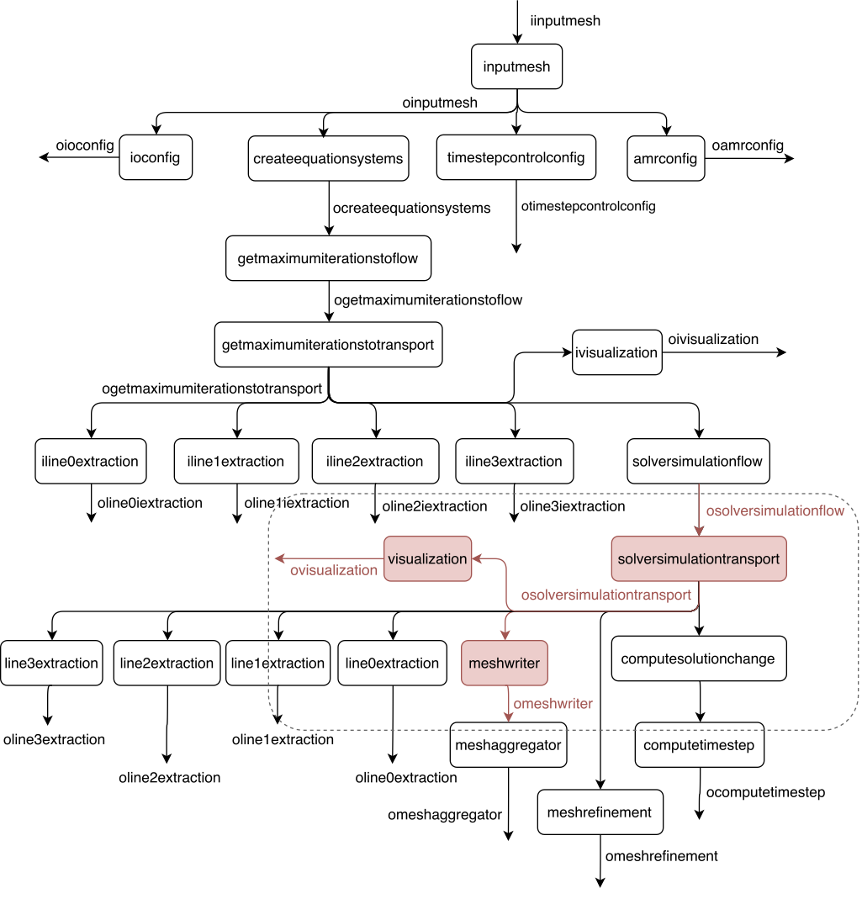

# Query Processor (QP)

Query Processor is the DfAnalyzer component responsible to get user input, which
characterizes and specifies the parameters and properties of the desired data,
and then crafts a query responsible to retrieve the necessary datasets, data
transformations and data attributes from the database.

The generated query is provided as SQL-based code, where:

* The SELECT clause is populated according to the user-specified projections,
  representing the data attributes chosen by the user;
* The WHERE clause, which is the most important one from the viewpoint of
  provenance tracing, acts like a filter by selecting and limiting the query to
  retrieve only the database rows that met a set of specified criteria
  (conditions);
* and, finally, the FROM clause contains the datasets from where the data attributes
  specified in the SELECT clause and the conditions specified in the WHERE
  clause are part of.

Query Processor's key function is called <tt>generateSqlQuery</tt>, which
contains the following arguments:

* D: the dataflow to be analyzed
* dsOrigins: the datasets to be used as sources for the path finding algorithm;
* dsDestinations: the datasets to be used as destinations (ends) for the path
  finding algorithm;
* type: the attribute mapping type, which can be either logical, physical or
  hybrid;
* projections: data attributes chosen to be part of the SELECT clause;
* selections: set of conditions intended to potentially filter and limit the
  query results, being part of the WHERE clause;
* dsIncludes: datasets that must be present in the paths found by the path
  finding algorithm;
* dsExcludes: datasets that must not be present in the paths found by the path
  finding algorithm.

By calling <tt>generateSqlQuery</tt> with the desired arguments, the user is
capable of generating a SQL code in a hassle-free manner.

## Example

**Table**: arguments for `generateSqlQuery`:

Argument | Value
--- | ---
D | D
dsOrigins | {osolversimulationflow}
dsDestinations | {ovisualization, omeshwriter}
type | physical
projections | {osolversimulationflow.time, osolversimulationflow.flow_final_linear_residual, osolversimulationflow.flow_norm_delta_u, osolversimulationtransport.transport_final_linear_residual, osolversimulationtransport.transport_norm_delta_u, ovisualization.png, omeshwriter.xdmf}
selections | {osolversimulationflow.time > 2, osolversimulationflow.time < 10, osolversimulationflow.r = 1}
dsIncludes | null
dsExcludes | null

**Code**: SQL-based code returned from `generateSqlQuery`:

```sql
SELECT osolversimulationflow.time, osolversimulationflow.flow_final_linear_residual, osolversimulationflow.flow_norm_delta_u, osolversimulationtransport.transport_final_linear_residual, osolversimulationtransport.transport_norm_delta_u, ovisualization.png, omeshwriter.xdmf
FROM osolversimulationflow, osolversimulationtransport, ovisualization, omeshwriter
WHERE (osolversimulationflow.time > 2) 
AND (osolversimulationflow.time < 10) 
AND (osolversimulationflow.r = 1) 
AND (osolversimulationflow.solversimulationtransport_task_id = osolversimulationtransport.solversimulationtransport_task_id) 
AND (osolversimulationtransport.visualization_task_id = ovisualization.visualization_task_id) 
AND (osolversimulationtransport.meshwriter_task_id = omeshwriter.meshwriter_task_id);
```

**Figure**: datasets selected in the previous query:



**Output**: sample results from the previous query:

time | flow_linear_residual | flow_norm_delta_u | transport_final_linear_residual | transport_norm_delta_u | png | xdmf
--- | --- | --- | --- | --- | --- | ---
3.10093 | 0.31609 | 0.00225 | 0.00030 |   0.00072 |  9999.png | 2.xmf
3.10093 | 0.31609 | 0.00225 | 0.00030 |         0 |  9999.png | 2.xmf
3.10093 | 0.31609 | 0.00225 | 0.00025 | 2.224e-06 |  9999.png | 2.xmf
3.10093 | 0.31609 | 0.00225 | 0.00025 |         0 |  9999.png | 2.xmf
5.41246 | 0.24713 | 0.00191 | 0.00073 | 0.0006674 | 14999.png | 3.xmf
5.41246 | 0.24713 | 0.00191 | 0.00073 |         0 | 14999.png | 3.xmf
5.41246 | 0.24713 | 0.00191 | 0.00048 | 4.693e-06 | 14999.png | 3.xmf
5.41246 | 0.24713 | 0.00191 | 0.00048 |         0 | 14999.png | 3.xmf
7.86956 | 0.27832 | 0.00563 | 0.00071 | 0.0007289 | 19999.png | 4.xmf
7.86956 | 0.27832 | 0.00563 | 0.00071 |         0 | 19999.png | 4.xmf
7.86956 | 0.27832 | 0.00563 | 0.00026 | 2.551e-06 | 19999.png | 4.xmf
7.86956 | 0.27832 | 0.00563 | 0.00026 |         0 | 19999.png | 4.xmf


<!-- vim: tw=80 -->
