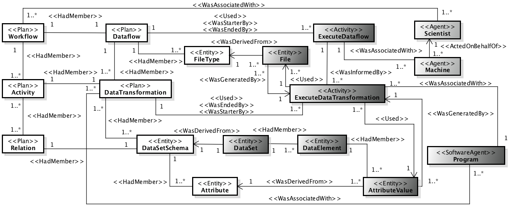
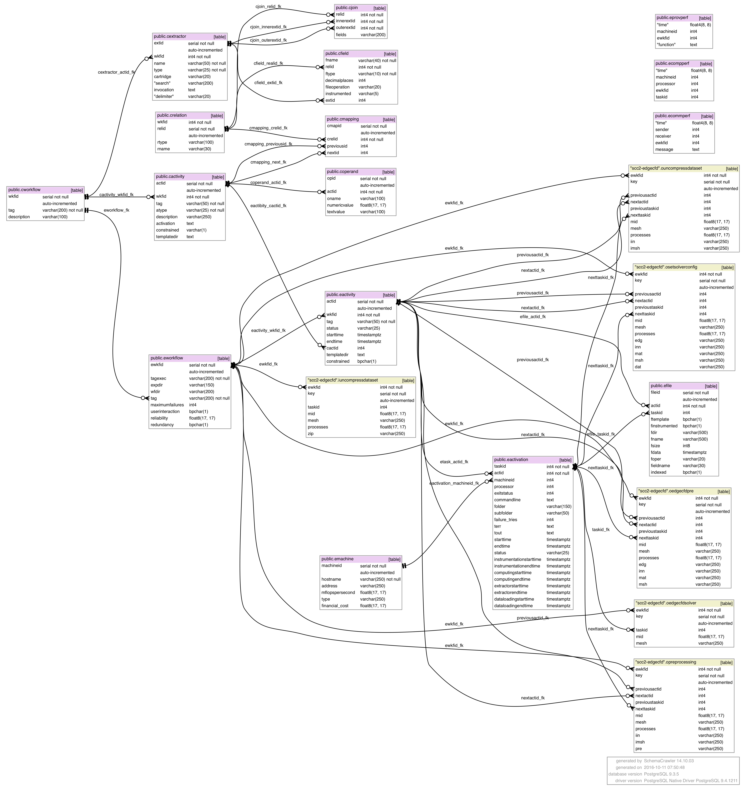

# PROV-Df: A PROV-Compliant Data Model

# Validation of PROV-Df using [ProvToolbox](http://lucmoreau.github.io/ProvToolbox/) and [ProvValidator](https://provenance.ecs.soton.ac.uk/validator/view/validator.html)
## We generate the following files, when we executed a scientific workflow in Computational Fluid Dynamics domain using A-Chiron SWMS
**XML file format**

**JSON file format**

**PROV-N file format**

**DOT file format**

# A-Chiron's provenance database 
## Computational Fluid Dynamics (CFD) workflow
### Without Raw Data Extraction (RDE)

### With RDE

### With RDE and Raw Data Indexing (RDI) using a positional indexing algorithm

### With RDE and RDI using FastBit tool

## Montage workflow with RDE
1. SQL script to generate the provenance database in PostgreSQL DBMS can be found [here](montage/montage.sql)
2. Example of this workflow can be found [here](../simulation/montage)

