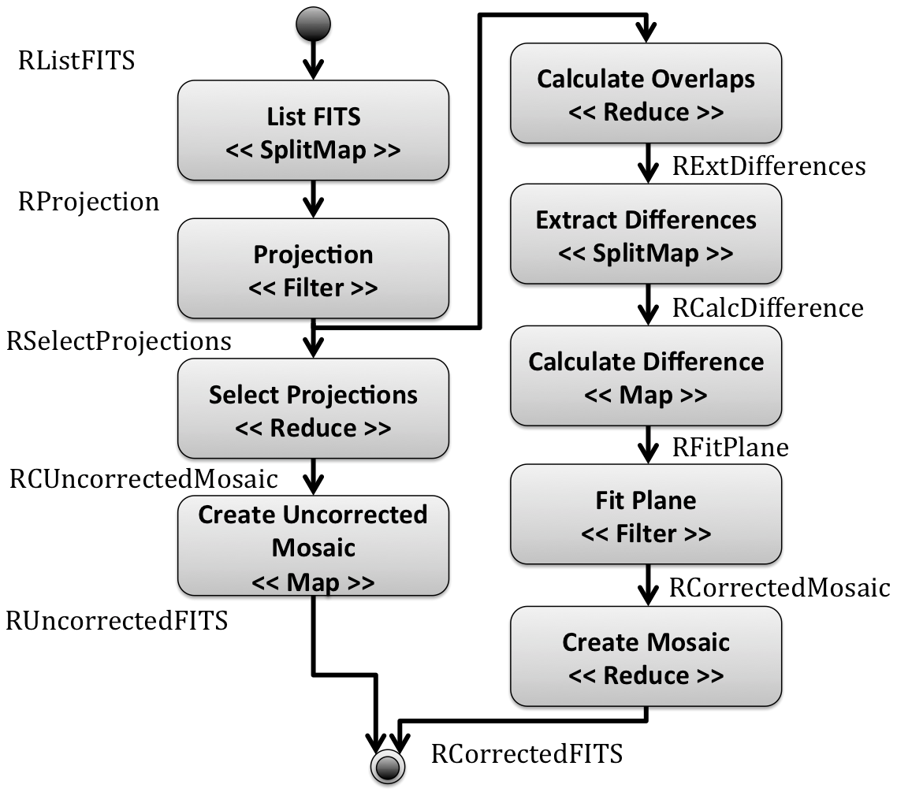

# Example of Montage workflow using A-Chiron SWMS

## Software requirements
1. [Java SE Development Kit (JDK)](http://www.oracle.com/technetwork/pt/java/index.html)
2. [PostgreSQL](https://www.postgresql.org) Database Management System (DBMS)
3. [Montage](http://montage.ipac.caltech.edu/), a toolkit for assembling [Flexible Image Transport System (FITS)](http://fits.gsfc.nasa.gov/) images into custom mosaics

## Configuration issues related to PostgreSQL DBMS
* Create a user named as `chiron` with password `chiron`
* Create a database named as `montage-extractor`
* Run the SQL script from `bin/database.sql` to generate the A-Chiron's database schema in `montage-extractor` database

## Installation issues of Montage toolkit
* Please follow the installation guide from the [Montage website](http://montage.ipac.caltech.edu/docs/download.html)
* After the Montage installation, you should define an environment variable named `MONTAGE` to the root directory where Montage was installed

## Configuration of the A-Chiron configuration file and the input dataset 
* Replace the tag `$WORKFLOW_DIR` in the `a-chiron.xml` and `exp/input.dataset` files to the workflow directory (i.e., $PATH/montage)

## Montage workflow specification
More information about the composition of data transformations in Montage workflow can be found in our [CCPE'16 paper](http://onlinelibrary.wiley.com/doi/10.1002/cpe.3616/abstract).

##### Montage workflow with algebraic operators

## Workflow submission using A-Chiron SWMS
* Submit the execution A-Chiron by the following command line:
`./submit.sh`

##### Content of submit.sh file
* It deletes files/directories from the previous workflow execution, restores provenance database by invoking A-Chiron Setup, and submits the execution of Montage workflow using A-Chiron Core

> 
echo "Removing data from a previous execution"   
rm -rf exp/Calculate*    
rm -rf exp/Create*   
rm -rf exp/Extract*   
rm -rf exp/Fit*   
rm -rf exp/List*   
rm -rf exp/Projection*   
rm -rf exp/Select*   
>
echo "Executing A-Chiron Setup..."   
bin/A-Chiron-Setup-v1.0 -d a-chiron.xml   
bin/A-Chiron-Setup-v1.0 -i a-chiron.xml   
>
echo "Executing A-Chiron Core..."   
bin/A-Chiron-Core-v1.0 a-chiron.xml   